# Asynchronous Advantage Actor-Critic (A3C)

🚧👷🛑 Under Construction!!!

## Table of Contents

1. [Overview](#overview)
2. [Setup](#setup)
3. [Results](#results)
4. [Analysis](#analysis)

## Overview

This repository contains an implementation of the Asynchronous Advantage Actor-Critic (A3C) algorithm using PyTorch. A3C is a reinforcement learning method that leverages parallel actor-learners to stabilize and speed up training, providing faster convergence and improved performance in complex environments. The algorithm is evaluated on various Atari environments using Gymnasium.

## Setup

### Required Dependencies

It's recommended to use a Conda environment to manage dependencies and avoid conflicts. You can create and activate a new Conda environment with the following commands:

```bash
conda create -n rl python=3.11
conda activate rl
```

After activating the environment, install the required dependencies using:

```bash
pip install -r requirements.txt
```

### Running the Algorithm

You can run the A3C algorithm on any supported Gymnasium Atari environment with a discrete action space using the following command:

```bash
python main.py --env 'MsPacmanNoFrameskip-v4'
```

#### Command-Line Arguments

- **Environment Selection**: Use `-e` or `--env` to specify the Gymnasium environment. The default is `None`, so you must specify an environment.
  
  Example:

  ```bash
  python main.py --env 'PongNoFrameskip-v4'
  ```

- **Number of Training Episodes**: Use `--n_games` to specify the number of games the agent should play during training. 

  Example:

  ```bash
  python main.py --n_games 5000
  ```

- **Parallel Environments**: Use `--n_envs` to specify the number of parallel environments to run during training. The default is 4.

  Example:

  ```bash
  python main.py --env 'AsterixNoFrameskip-v4' --n_envs 16
  ```

Using a Conda environment along with these flexible command-line options will help you efficiently manage your dependencies and customize the training process for your specific needs.

## Results
 
<table>
    <tr>
        <td>
            <p><b>AirRaid</b></p>
            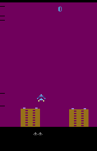
        </td>
        <td>
            <p><b>Alien</b></p>
            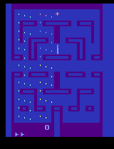
        </td>
        <td>
            <p><b>Amidar</b></p>
            
        </td>
    </tr>
    <tr>
        <td>
            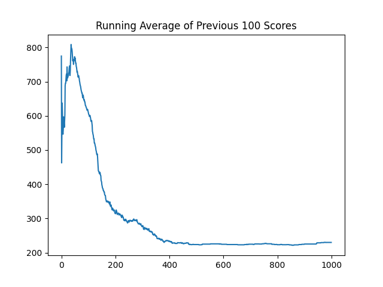
        </td>
        <td>
            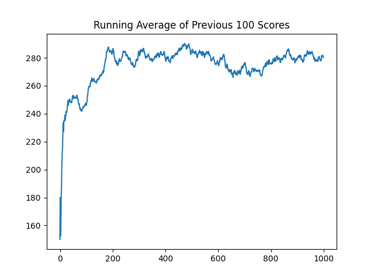
        </td>
        <td>
            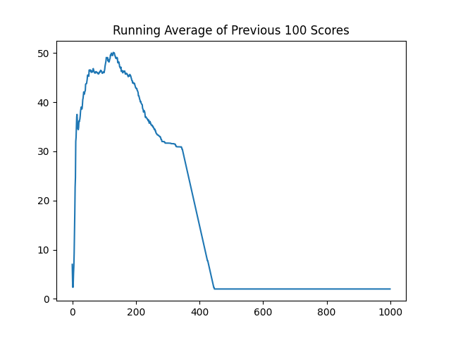
        </td>
    </tr>
</table>
<table>
    <tr>
        <td>
            <p><b>Assault</b></p>
            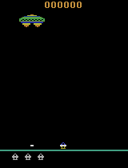
        </td>
        <td>
            <p><b>Asterix</b></p>
            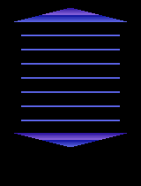
        </td>
        <td>
            <p><b>Asteroids</b></p>
            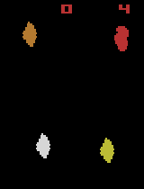
        </td>
    </tr>
    <tr>
        <td>
            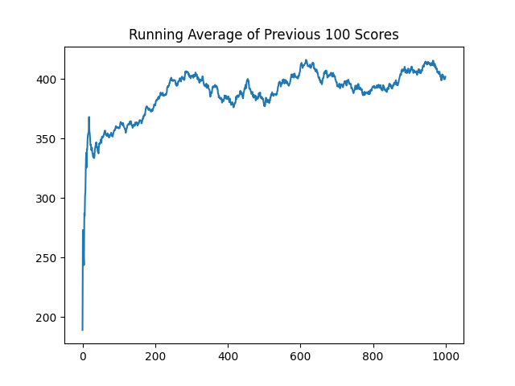
        </td>
        <td>
            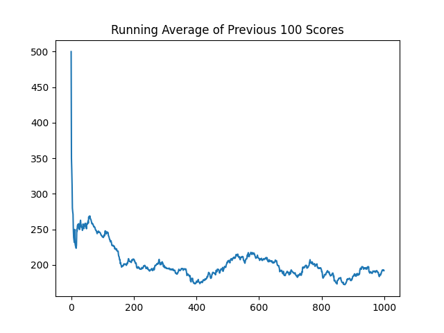
        </td>
        <td>
            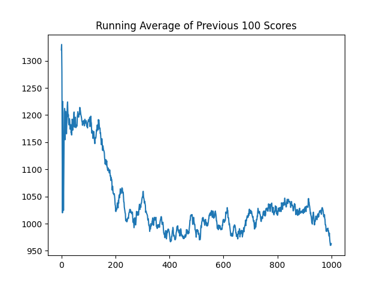
        </td>
    </tr>
</table>
<table>
    <tr>
        <td>
            <p><b>Atlantis</b></p>
            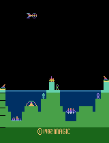
        </td>
        <td>
            <p><b>BankHeist</b></p>
            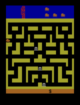
        </td>
        <td>
            <p><b>BattleZone</b></p>
            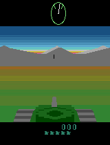
        </td>
    </tr>
    <tr>
        <td>
            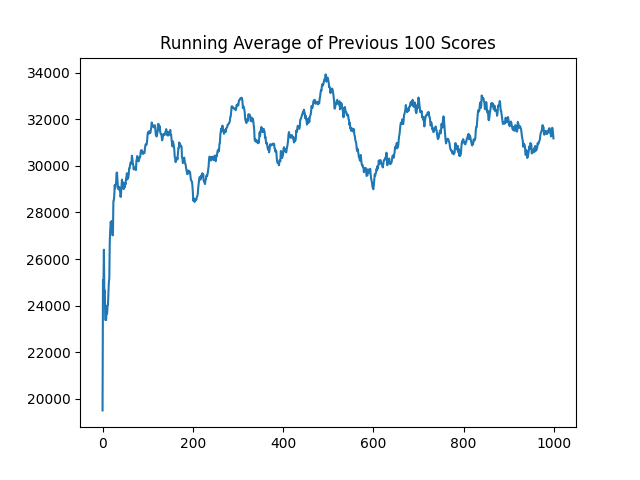
        </td>
        <td>
            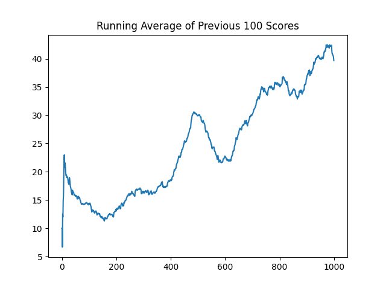
        </td>
        <td>
            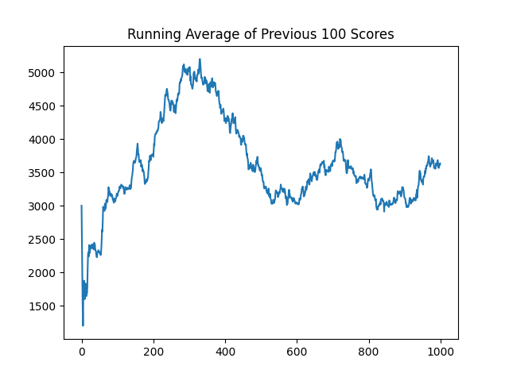
        </td>
    </tr>
</table>
<table>
    <tr>
        <td>
            <p><b>BeamRider</b></p>
            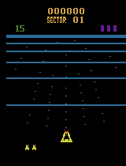
        </td>
        <td>
            <p><b>Berzerk</b></p>
            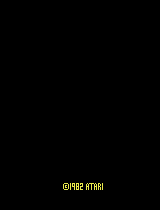
        </td>
        <td>
            <p><b>Bowling</b></p>
            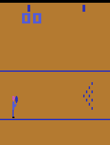
        </td>
    </tr>
    <tr>
        <td>
            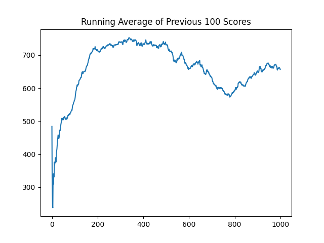
        </td>
        <td>
            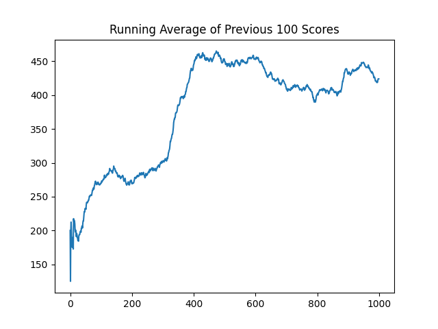
        </td>
        <td>
            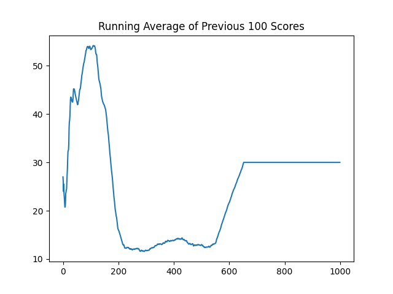
        </td>
    </tr>
</table>
<table>
    <tr>
        <td>
            <p><b>Boxing</b></p>
            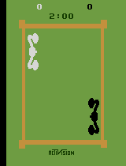
        </td>
        <td>
            <p><b>Breakout</b></p>
            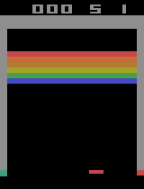
        </td>
        <td>
            <p><b>Carnival</b></p>
            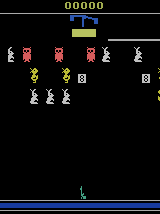
        </td>
    </tr>
    <tr>
        <td>
            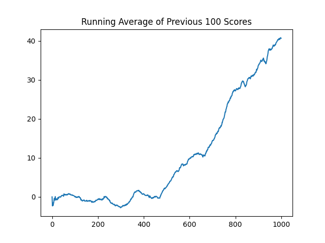
        </td>
        <td>
            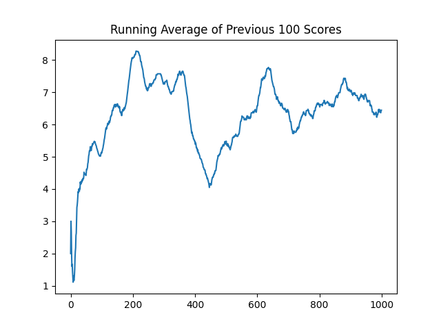
        </td>
        <td>
            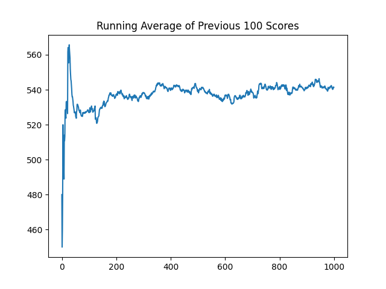
        </td>
    </tr>
</table>
<table>
    <tr>
        <td>
            <p><b>Centipede</b></p>
            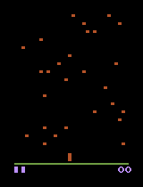
        </td>
        <td>
            <p><b>ChopperCommand</b></p>
            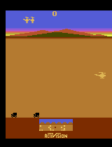
        </td>
        <td>
            <p><b>CrazyClimber</b></p>
            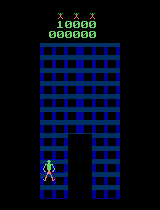
        </td>
    </tr>
    <tr>
        <td>
            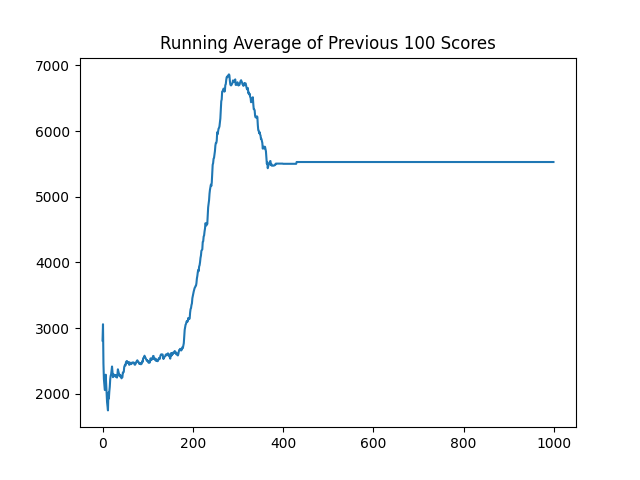
        </td>
        <td>
            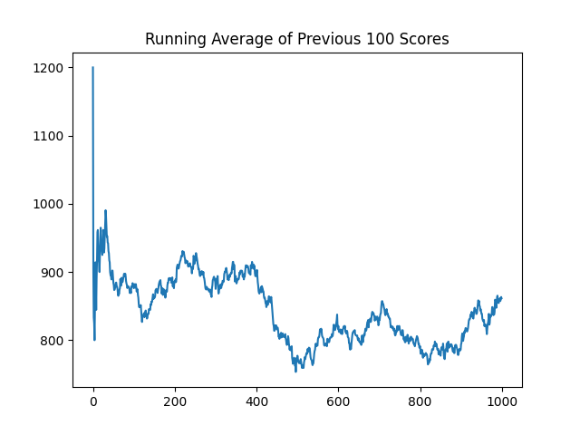
        </td>
        <td>
            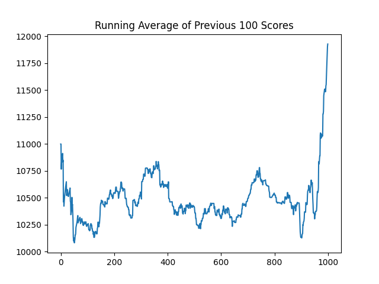
        </td>
    </tr>
</table>

## Analysis

<!--
## Analysis of Results

This section will explore the performance of the A3C algorithm across various Atari games, focusing on its ability to stabilize training through parallel actor-learners and the advantage function. We will compare the results with other RL methods to highlight the strengths and potential trade-offs of A3C.
-->

## Acknowledgements

Special thanks to Phil Tabor, an excellent teacher! I highly recommend his [Youtube channel](https://www.youtube.com/machinelearningwithphil).
